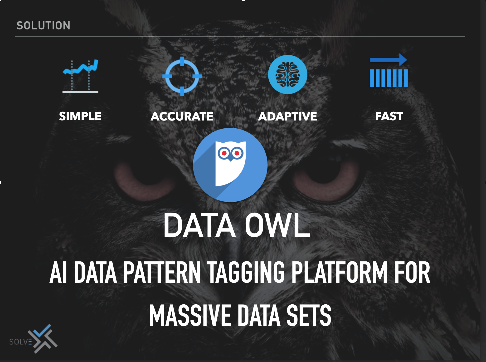
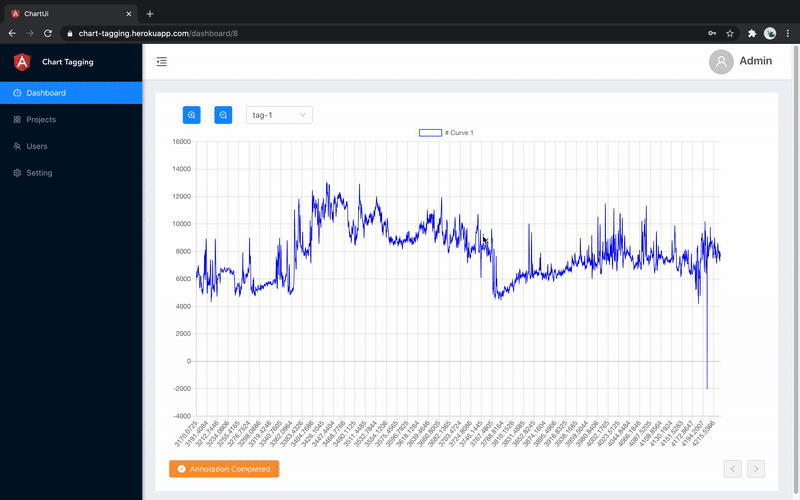

## Description
[Solvex AI](http://solvex.ai/) is a free open source *Time Series Data Annotation tool* 
Making the process of preparing a dataset for training machine learning algorithm much easier and faster. 
Prepared labels can be downloaded in one of multiple supported formats. 
Frontend application is written in Angularjs.
Backend application is written using Django, python and sql data bases. 

## Sneak Peek

## Features 
* Add admin
* Add/remove manager 
* Add/remove project
* Define group for project/team
* Invite annotators
* Assign annotators to different projects 
* Define number of tags for each data
* Upload data
* Download Annotated data
* Track annotators and jobs

[features](images/user_project.gif)

## Quick Acces
[Demo](https://chart-tagging.herokuapp.com/)
* User name: Admin
* Passwpord: 123

## Contribution
Feel free to file [issues](https://github.com/korjani/time-series-annotation-tool/issues) or [pull requests](https://github.com/korjani/time-series-annotation-tool/pulls).

## Citation
@MISC{SolveX AI,
   author = {Mehdi Korjani},
   title = {{Time Series Data Tagging}},
   howpublished = "\url{https://github.com/korjani/time-series-annotation-tool/}",
   year = {2020},
}
## License
This project is licensed under the GPL-3.0 License - see the [LICENSE](LICENSE) file for details

Copyright (c) 2020-present, Mehdi Korjani